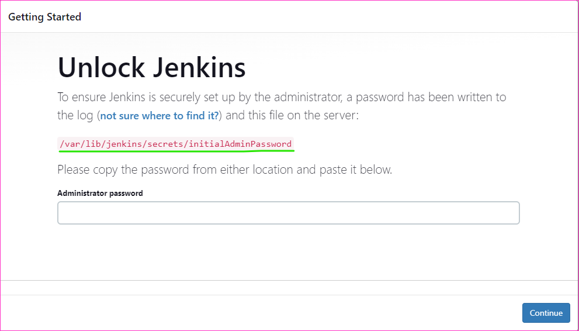

Manual Steps to build the NetFlix application
---------------------------------------

* Install docker
```
sudo apt install
curl -fsSL https://get.docker.com -o install-docker.sh
sh install-docker.sh
sudo usermod -aG docker ubuntu
# exit the server
# and login the server again
docker info

```


* Clone the github repository to the server [Refer Here](https://github.com/rajkumarqt/ProjectsRelated/tree/main/devsecopsproject) for the project repository.
* 
* To build the docker image run the below command
```
docker image build -t <your-image-name>:latest .
```


* to create the container based on the image.
```
docker container run -d -P rajkumar207/aplhine
docker image ls
docker container ls
```


* to access the application 
```
http://<public-ip-address>:port-number
```


To automate the above Application
----------------------------------
* Prerequisites
    * We need two servers to create the application
    * One is docker and second one is K8S
    * Configure the two servers in jenkins
* We can use jenkins server as a docker slave, otherwise create one more server in AWS console
* Firstly we can create one server name it as jenkins in the AWS console


* We need to execute the some commands to the install necessary softwares
```
sudo apt update
sudo apt install openjdk-17-jdk -y
curl -fsSL https://get.docker.com -o install-docker.sh
sh install-docker.sh
sudo usermod -aG docker ubuntu
sudo useradd jenkins
sudo usermod -aG docker jenkins
grep docker /etc/group
# `docker:x:999:ubuntu,jenkins`
exit
# relogin the server
docker info


``` 

* Open sudoers file and edit and add the jenkins user to sudoers file as shown below image

* To installing jenkins [Refer Here](https://www.jenkins.io/doc/book/installing/linux/#long-term-support-release) for the official site for  installing jenkins on Linux server
* Complete the jenkins installation and open browser for jenkins web 
```
http://<pub-id-address>:8080
```

* Take that `initialAdminPassword` for Adminstrator password


