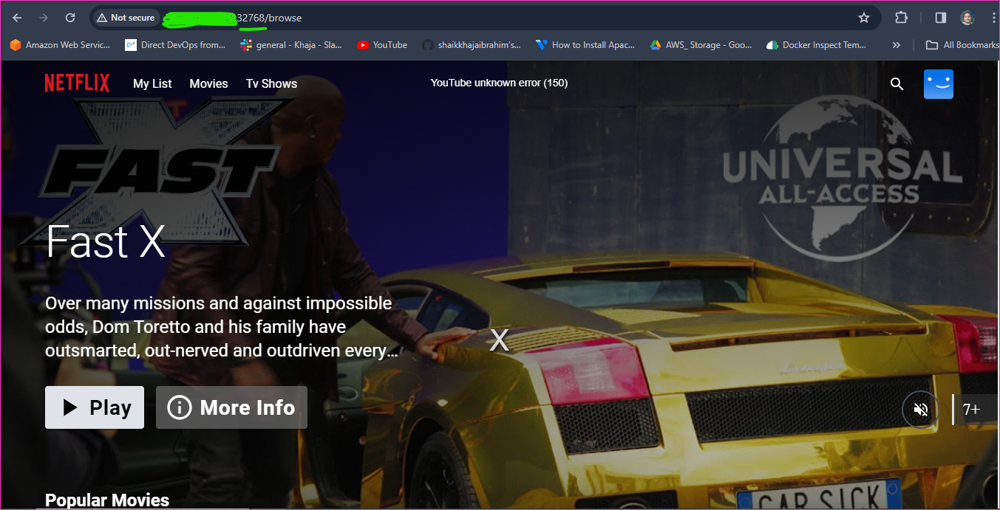

Manual Steps to build the application
---------------------------------------

* Install docker
```
sudo apt install
curl -fsSL https://get.docker.com -o install-docker.sh
sh install-docker.sh
sudo usermod -aG docker ubuntu
# exit the server
# and login the server again
docker info

```


* Clone the github repository to the server [Refer Here](https://github.com/rajkumarqt/ProjectsRelated/tree/main/devsecopsproject) for the project repository.
* 
* To build the docker image run the below command
```
docker image build -t <your-image-name>:latest .
```


* to create the container based on the image.
```
docker container run -d -P rajkumar207/aplhine
docker image ls
docker container ls
```


* to access the application 
```
http://<public-ip-address>:port-number
```
